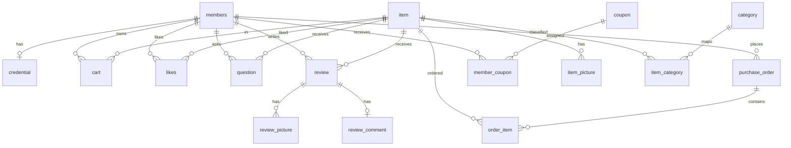

# Backend DB Schema

이 문서는 `domain` 패키지의 JPA 엔티티 기준 DB 스키마입니다. Hibernate naming strategy 기본값에 따라 Java camelCase 필드는 일반적으로 snake_case 컬럼으로 매핑됩니다.

## 개요

- ORM: Spring Data JPA, Hibernate
- 기본 DB: PostgreSQL
- DDL 설정: `SPRING_JPA_HIBERNATE_DDL_AUTO` 환경 변수로 제어, 기본값 `update`
- ID 생성: 대부분 `GenerationType.IDENTITY`

## ERD

## Enum 값

### `Role`

- `ROLE_USER`
- `ROLE_ADMIN`

### `IdentityProvider`

- `LOCAL`
- `KAKAO`

### `CategoryName`

- `NEW`
- `BEST`
- `SALE`
- `SPRING`
- `FALL`
- `SUMMER`
- `WINTER`

### `DiscountType`

- `PERCENT`
- `FIXED_AMOUNT`

### `OrderStatus`

- `ORDERED`
- `PAID`
- `SHIPPING`
- `DELIVERED`
- `CANCELED`

## 테이블 상세

### `members`

엔티티: `Member`

| 컬럼 | 타입 예시 | 제약/설명 |
|---|---|---|
| `id` | bigint | PK, identity |
| `nickname` | varchar | not null |
| `email` | varchar | unique |
| `phone_number` | varchar | nullable |
| `role` | varchar | enum string |
| `created_at` | timestamp | 생성 시각 |
| `point` | integer | 보유 포인트, 생성 시 0 |

관계:

- `credential.member_id`와 1:1
- `cart.member_id`, `likes.member_id`, `question.member_id`, `review.member_id`, `purchase_order.member_id`, `member_coupon.member_id`의 부모

### `credential`

엔티티: `Credential`

| 컬럼 | 타입 예시 | 제약/설명 |
|---|---|---|
| `id` | bigint | PK, identity |
| `identity_provider` | varchar | `LOCAL`, `KAKAO` |
| `password` | varchar | LOCAL은 BCrypt hash, KAKAO는 kakao id 문자열 |
| `member_id` | bigint | FK to `members.id` |

주의:

- 코드상 DB unique 제약은 없지만 로그인 식별은 `member.email + identityProvider` 또는 `identityProvider + password`로 조회합니다.
- 운영에서는 provider별 외부 ID 컬럼을 분리하는 개선을 고려할 수 있습니다.

### `item`

엔티티: `Item`

| 컬럼 | 타입 예시 | 제약/설명 |
|---|---|---|
| `id` | bigint | PK, identity |
| `name` | varchar | 상품명 |
| `price` | integer | 정가 |
| `sale_price` | integer | 판매가. 0보다 크면 주문 단가로 사용 |
| `shipping_price` | integer | 상품 배송비 필드. 현재 주문 계산은 전역 배송비 규칙 사용 |
| `size` | varchar | 기본 사이즈 옵션 |
| `color` | varchar | 기본 색상 옵션 |
| `information` | text | 상품 설명 |
| `created_at` | timestamp | 생성 시각 |

관계:

- `item_picture`, `item_category`는 cascade all, orphan removal
- 상품 삭제 서비스는 cart, like, review, question을 먼저 삭제한 뒤 item을 삭제합니다.

### `item_picture`

엔티티: `ItemPicture`

| 컬럼 | 타입 예시 | 제약/설명 |
|---|---|---|
| `id` | bigint | PK, identity |
| `url` | varchar | 이미지 URL |
| `item_id` | bigint | FK to `item.id` |

### `category`

엔티티: `Category`

| 컬럼 | 타입 예시 | 제약/설명 |
|---|---|---|
| `id` | bigint | PK, identity |
| `name` | varchar | `CategoryName` enum string |

초기화:

- 애플리케이션 시작 시 `CategoryName.values()`를 기준으로 없는 카테고리를 생성합니다.

### `item_category`

엔티티: `ItemCategory`

| 컬럼 | 타입 예시 | 제약/설명 |
|---|---|---|
| `id` | bigint | PK, identity |
| `item_id` | bigint | FK to `item.id` |
| `category_id` | bigint | FK to `category.id` |

용도:

- 상품과 카테고리의 N:M 연결 테이블입니다.

### `cart`

엔티티: `Cart`

| 컬럼 | 타입 예시 | 제약/설명 |
|---|---|---|
| `id` | bigint | PK, identity |
| `item_id` | bigint | FK to `item.id` |
| `member_id` | bigint | FK to `members.id` |
| `color` | varchar | 선택 색상 |
| `size` | varchar | 선택 사이즈 |
| `quantity` | integer | 수량 |

비즈니스 규칙:

- 같은 `item_id`, `member_id`, `color`, `size` 조합은 서비스에서 찾아 수량을 증가시킵니다.
- DB unique 제약은 현재 코드에 없습니다.

### `likes`

엔티티: `ItemLike`, 테이블명 명시: `@Table(name = "likes")`

| 컬럼 | 타입 예시 | 제약/설명 |
|---|---|---|
| `id` | bigint | PK, identity |
| `item_id` | bigint | FK to `item.id` |
| `member_id` | bigint | FK to `members.id` |

비즈니스 규칙:

- 중복 좋아요는 서비스에서 `existsByItemIdAndMemberId`로 방지합니다.
- DB unique 제약은 현재 코드에 없습니다.

### `review`

엔티티: `Review`

| 컬럼 | 타입 예시 | 제약/설명 |
|---|---|---|
| `id` | bigint | PK, identity |
| `content` | text | 리뷰 내용 |
| `rating` | integer | 1부터 5까지 API validation |
| `product_option` | varchar | 구매 옵션 표시 |
| `created_at` | timestamp | 작성 시각 |
| `item_id` | bigint | FK to `item.id` |
| `member_id` | bigint | FK to `members.id` |

관계:

- `review_picture`와 1:N, cascade all, orphan removal
- `review_comment`와 1:1, cascade all, orphan removal

비즈니스 규칙:

- 구매 이력이 있는 상품만 리뷰 작성 가능
- 허용 주문 상태: `ORDERED`, `PAID`, `SHIPPING`, `DELIVERED`

### `review_picture`

엔티티: `ReviewPicture`

| 컬럼 | 타입 예시 | 제약/설명 |
|---|---|---|
| `id` | bigint | PK, identity |
| `url` | varchar | 이미지 URL |
| `review_id` | bigint | FK to `review.id` |

### `review_comment`

엔티티: `ReviewComment`

| 컬럼 | 타입 예시 | 제약/설명 |
|---|---|---|
| `id` | bigint | PK, identity |
| `comment` | text | 관리자 답변 |
| `created_at` | timestamp | 생성 시각 |
| `review_id` | bigint | FK to `review.id` |

용도:

- 리뷰 하나에 관리자 답변 하나를 연결합니다.

### `question`

엔티티: `Question`

| 컬럼 | 타입 예시 | 제약/설명 |
|---|---|---|
| `id` | bigint | PK, identity |
| `title` | varchar | 문의 제목 |
| `content` | text | 문의 내용 |
| `answer` | text | 관리자 답변, nullable |
| `created_at` | timestamp | 작성 시각 |
| `item_id` | bigint | FK to `item.id`, nullable 가능 |
| `member_id` | bigint | FK to `members.id`, nullable 가능 |

주의:

- `QuestionService.createQuestion`은 `request.itemId()`가 null이면 item 없이 질문을 저장할 수 있습니다.
- 프론트 요청 타입은 `itemId`를 필수로 사용합니다.

### `coupon`

엔티티: `Coupon`

| 컬럼 | 타입 예시 | 제약/설명 |
|---|---|---|
| `id` | bigint | PK, identity |
| `name` | varchar | not null |
| `discount_type` | varchar | `PERCENT`, `FIXED_AMOUNT` |
| `discount_value` | integer | 할인율 또는 할인액 |
| `start_time` | timestamp | 사용 시작 |
| `end_time` | timestamp | 사용 종료 |

주문 계산 규칙:

- `PERCENT`: `itemTotalAmount * discountValue / 100`
- `FIXED_AMOUNT`: `discountValue`
- 할인액은 상품 합계를 초과하지 않음

### `member_coupon`

엔티티: `MemberCoupon`

| 컬럼 | 타입 예시 | 제약/설명 |
|---|---|---|
| `id` | bigint | PK, identity |
| `created_at` | timestamp | 지급 시각 |
| `member_id` | bigint | FK to `members.id` |
| `coupon_id` | bigint | FK to `coupon.id` |

현재 코드에서는 생성자/서비스 사용이 구현되어 있지 않습니다. 향후 회원별 쿠폰 지급 기능을 위한 엔티티로 보입니다.

### `purchase_order`

엔티티: `PurchaseOrder`

| 컬럼 | 타입 예시 | 제약/설명 |
|---|---|---|
| `id` | bigint | PK, identity |
| `order_number` | varchar | `ORD-yyyyMMddHHmmssSSS` |
| `member_id` | bigint | FK to `members.id` |
| `status` | varchar | `OrderStatus` enum string |
| `recipient_name` | varchar | embedded `ShippingAddress`, not null |
| `phone_number` | varchar | embedded `ShippingAddress`, not null |
| `zip_code` | varchar | embedded `ShippingAddress`, not null |
| `address1` | varchar | embedded `ShippingAddress`, not null |
| `address2` | varchar | embedded `ShippingAddress`, nullable |
| `item_total_amount` | integer | 상품 합계 |
| `shipping_fee` | integer | 배송비 |
| `coupon_discount_amount` | integer | 쿠폰 할인액 |
| `point_discount_amount` | integer | 포인트 사용액 |
| `payment_amount` | integer | 최종 결제 금액 |
| `created_at` | timestamp | 주문 생성 시각 |
| `canceled_at` | timestamp | 취소 시각, nullable |

비즈니스 규칙:

- 생성 시 상태는 `ORDERED`
- `SHIPPING`, `DELIVERED` 상태는 취소 불가
- 취소 시 상태는 `CANCELED`, `canceled_at` 기록

### `order_item`

엔티티: `OrderItem`

| 컬럼 | 타입 예시 | 제약/설명 |
|---|---|---|
| `id` | bigint | PK, identity |
| `order_id` | bigint | FK to `purchase_order.id` |
| `item_id` | bigint | FK to `item.id` |
| `item_name` | varchar | 주문 당시 상품명 snapshot |
| `color` | varchar | 주문 옵션 색상 |
| `size` | varchar | 주문 옵션 사이즈 |
| `unit_price` | integer | 주문 당시 단가 snapshot |
| `quantity` | integer | 수량 |
| `total_price` | integer | `unit_price * quantity` |

## 초기 데이터

`DataInitializer`가 애플리케이션 시작 시 아래 데이터를 보장합니다.

| 데이터 | 조건 | 내용 |
|---|---|---|
| 카테고리 | 없는 enum 값만 생성 | `NEW`, `BEST`, `SALE`, `SPRING`, `FALL`, `SUMMER`, `WINTER` |
| 테스트 회원 | `user@example.com` 없을 때 | email `user@example.com`, password `password`, role `ROLE_USER` |
| 관리자 | `APP_ADMIN_EMAIL`, `APP_ADMIN_PASSWORD`가 있을 때 | 해당 계정을 `ROLE_ADMIN`으로 생성/갱신 |
| 샘플 상품 | item count가 0일 때 | 침구 상품 6개와 이미지 URL |

## 인덱스/제약 개선 후보

현재 엔티티에 명시된 DB 제약은 많지 않습니다. 운영 안정성을 높이려면 다음을 고려하세요.

| 대상 | 권장 제약 |
|---|---|
| `members.email` | 이미 unique 지정됨 |
| `credential(member_id, identity_provider)` | unique |
| `category.name` | unique |
| `cart(member_id, item_id, color, size)` | unique |
| `likes(member_id, item_id)` | unique |
| `review_comment.review_id` | unique |
| `purchase_order.order_number` | unique |
| FK 컬럼 전반 | 조회 패턴에 맞춘 index |
